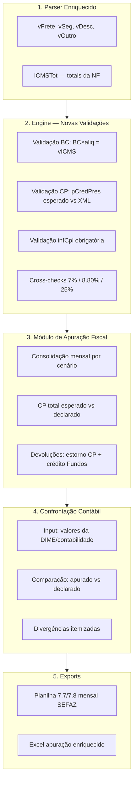

# Plano: Apuração ICMS 100% — Confrontação Contábil

> **Revisão 2 (2026-04-10)** — Correções aplicadas após auditoria do plano contra o código atual:
> - **DIFAL removido do escopo** (não há casos de DIFAL no TTD 410).
> - **Fundos mantidos em 0,4% flat sobre BC integral** — Fase 4 original (exoneração/FUMDES) eliminada.
> - **Terminologia**: trocado `ALERTA` por `AVISO` (StatusType do código é `'OK' | 'INFO' | 'AVISO' | 'DIVERGENCIA' | 'ERRO'`).
> - **B3-CAMEX renomeado para B2-Industrial** para evitar colisão com o B3 industrial puro já existente.
> - **Fase 1 expandida**: incluir `vProd` no objeto `totais` (necessário para planilha 7.8).
> - **Validação "BC integral para Fundos" removida da Fase 2** (perdeu sentido sem a fórmula real de fundos).
> - **Prioridade 1.5 em ramificações**: validar antes que `compareRamificacoes` aceita floats.

## Contexto

O ICMS Auditor classifica cenários TTD 410 e valida alíquota/CST/CFOP item a item, mas **não faz apuração fiscal real**. Conforme a seção 18 do documento de regras ("GAPS CONHECIDOS"), faltam peças críticas:

- **Sem validação de BC**: não verifica se BC × alíquota = vICMS (consistência matemática)
- **Sem validação de valor total**: não confronta vICMS calculado vs declarado
- **Sem validação de CP**: parser lê `gCred` (cCredPresumido/pCredPresumido/vCredPresumido) mas nunca verifica se os valores batem com o esperado pelo cenário
- **Sem reconciliação com contabilidade**: não confronta apurado vs DIME/EFD
- **Sem planilha 7.7/7.8**: controle mensal obrigatório SEFAZ não é gerado
- **Sem validação de infCpl**: "diferimento parcial" obrigatório não é verificado
- **Campos do XML não extraídos**: vFrete, vSeg, vDesc, vOutro, ICMSTot

> **Fora de escopo**: DIFAL (não se aplica ao TTD 410) e recálculo de fundos (mantido 0,4% flat sobre BC integral).

Sem essas peças, erros de apuração passam despercebidos → passivo fiscal + perda de dinheiro.

## Visão Geral



---

## Fase 1: Parser Enriquecido

**Objetivo:** Extrair campos fiscais do XML necessários para validação e exports.

**Estado atual confirmado:** Nenhum dos campos abaixo existe em `ItemData` ou `NfeData`. `gCred` (cCredPresumido/pCredPresumido/vCredPresumido) já é extraído em `parser.ts:85-96`.

### `src/types/nfe.ts` — Adicionar campos a `ItemData`:
```ts
vFrete: number;
vSeg: number;
vDesc: number;
vOutro: number;
```

Adicionar a `NfeData`:
```ts
totais: {
  vBC: number; vICMS: number; vBCST: number; vST: number;
  vProd: number; vFrete: number; vSeg: number; vDesc: number;
  vOutro: number; vNF: number;
};
```

### `src/engine/parser.ts`:
- `parseItem()`: extrair vFrete/vSeg/vDesc/vOutro de `<prod>`
- Nova `parseTotais()`: extrair `<ICMSTot>` com todos os campos acima
- `parseNfe()`: incluir totais no retorno

### Impacto colateral (raio de alcance):
- Fixtures de teste em `src/__tests__/` precisam de campo `totais` mockado
- Consumidores atuais de `NfeData` (Dashboard, ReconciliacaoPanel, exportExcel): aditivo, mas precisa revisar se algum usa spread que quebraria.

### Testes: `src/engine/__tests__/parser.test.ts`
- Fixture XML com campos novos, verificar parsing

---

## Fase 2: Validação de Base de Cálculo (Gap #2 e #3 do doc)

**Objetivo:** Detectar inconsistências matemáticas — "Sem validação de valor total" e "Sem validação de BC".

**Estado atual confirmado:** Nenhum check de `vBC × pICMS ≈ vICMS` existe no engine.

### Novo: `src/engine/bcValidation.ts`

```ts
export function validarBaseCalculo(item: ItemData, cenario: CenarioConfig): ValidationResult[]
```

3 validações:
1. **Consistência matemática**: `|vBC × (pICMS/100) - vICMS| < 0.02` — ERRO se divergir
2. **BC vs vProd**: BC < vProd × 0.98 e CST ≠ 20 e pRedBC = 0 → AVISO (possível redução não declarada)
3. **Desconto na BC**: vDesc > 0 e BC ≈ vProd - vDesc → INFO ("Desconto reduzindo BC")

### `src/engine/validator.ts` — Integração:
- Após Etapa 3 (validar alíquota), inserir chamada a `validarBaseCalculo()`
- Novo campo `bcConsistente: boolean` em `ItemValidation` (analogous to padrão já existente)

### Testes: `src/engine/__tests__/bcValidation.test.ts`

---

## Fase 3: Validação de Crédito Presumido

**Objetivo:** O parser lê `gCred` (cCredPresumido, pCredPresumido, vCredPresumido) mas nunca valida os valores contra o esperado pelo cenário.

**Estado atual confirmado:** Campos já presentes em `ItemData` ([nfe.ts:40-42](../src/types/nfe.ts#L40-L42)), usados apenas para agregação em `reconciliacao.ts:108-118`. Zero validação.

### Novo: `src/engine/cpValidation.ts`

```ts
export function validarCreditoPresumido(item: ItemData, cenario: CenarioConfig): ValidationResult[]
```

4 validações:
1. **CP presente quando esperado**: `cenario.temCP && !cCredPresumido` → AVISO
2. **CP ausente quando não deveria**: `!cenario.temCP && cCredPresumido` → AVISO
3. **Percentual CP**: `pCP_esperado = aliquotaDestacada - cargaEfetiva`. Se `|pCredPresumido - esperado| > 0.1` → DIVERGENCIA
4. **Valor CP**: `vCP_esperado = vBC × (pCredPresumido/100)`. Se `|vCredPresumido - esperado| > 0.02` → DIVERGENCIA

### `src/engine/validator.ts` — Integração:
- Chamar após validação de alíquota
- Adicionar a `NfeValidation`:
```ts
totalCPDeclarado: number;   // soma vCredPresumido
totalCPEsperado: number;    // soma CP calculado
```

### Testes: `src/engine/__tests__/cpValidation.test.ts`

---

## ~~Fase 4: Cálculo Real de Fundos~~ — **REMOVIDA**

**Decisão (rev2)**: Fundos permanecem em **0,4% flat sobre BC integral**, conforme implementação atual em `calculator.ts:56` e `reconciliacao.ts:77`. Sem exoneração, sem FUMDES separado, sem piso complementar. Nenhuma mudança necessária nesta fase.

---

## Fase 5: Validação de Informações Complementares

**Objetivo:** Verificar textos obrigatórios no infCpl.

**Estado atual confirmado:** `infCpl` é parseado em `parser.ts:152-153` e armazenado em `NfeData`. Nenhuma validação existente.

### Novo: `src/engine/infCplValidation.ts`

```ts
export function validarInfoComplementares(
  infCpl: string, cenarioId: string, cenario: CenarioConfig
): ValidationResult[]
```

- `temDiferimentoParcial === true`: infCpl deve conter "diferimento parcial" ou "ICMS diferido" → AVISO se ausente
- B3/B10/B11 (saída 10%): verificar menção a comunicação/estorno
- CAMEX: verificar menção a "sem similar" ou "GECEX"

### `src/engine/validator.ts` — chamar após validação de CFOP

### Testes: `src/engine/__tests__/infCplValidation.test.ts`

---

## Fase 6: Módulo de Apuração Mensal + Confrontação

**Objetivo:** Consolidar apuração do período e permitir comparação com contabilidade/DIME.

### Novo: `src/engine/apuracao.ts`

```ts
export interface ApuracaoMensal {
  periodo: string;                    // "2026-03"
  // Saídas
  totalBCSaidas: number;
  totalICMSDestacado: number;
  totalCPApropriado: number;
  totalICMSRecolher: number;
  totalFundos: number;                // 0,4% × BC integral (simples)
  totalRecolherComFundos: number;
  // Devoluções
  totalBCDevolucoes: number;
  totalCPEstornado: number;
  totalFundosCredito: number;
  // Líquido
  liquidoICMSRecolher: number;
  liquidoFundos: number;
  liquidoTotal: number;
  // Por cenário (para DIME quadro 46)
  porCenario: ApuracaoCenario[];
  // Divergências
  divergencias: ApuracaoDivergencia[];
}

// Confrontação (input do usuário)
export interface DadosContabilidade {
  icmsDebitado: number;
  icmsCreditado: number;
  cpApropriado: number;
  fundosRecolhidos: number;
}

export interface ConfrontacaoResult {
  diffICMS: number;
  diffCP: number;
  diffFundos: number;
  status: 'ok' | 'divergente';
  observacoes: string[];
}

export function buildApuracaoMensal(results: NfeValidation[], regras: RegrasConfig): ApuracaoMensal
export function confrontarContabilidade(apuracao: ApuracaoMensal, contab: DadosContabilidade): ConfrontacaoResult
```

### Testes: `src/engine/__tests__/apuracao.test.ts`

---

## Fase 7: Confrontação Contábil — UI

**Objetivo:** UI para inserir valores da contabilidade e ver comparação.

**Estado atual confirmado:** [ReconciliacaoPanel.tsx](../src/components/ReconciliacaoPanel.tsx) existe (123 linhas), é **read-only**, renderiza duas tabelas (TTD e CP). Sem state, sem inputs. **Adicionar inputs requer refactor médio** (não trivial), incluindo state management e validação de inputs numéricos.

### `src/components/ReconciliacaoPanel.tsx` — Expandir (manter tudo existente):

Adicionar seção "Confrontação Contábil" ABAIXO das tabelas existentes:
- 4 inputs: ICMS Debitado, ICMS Creditado, CP Apropriado, Fundos Recolhidos
- State local com `useState` (não precisa ir ao Firebase)
- Tabela comparativa: "Apurado pelo Sistema" | "Contabilidade" | "Diferença" | "Status"
- Semáforo: verde (< 1%), amarelo (1-5%), vermelho (> 5%)
- Observações automáticas quando há diferença

**Zero alteração** no layout/funcionalidade existente — apenas seção nova abaixo.

---

## Fase 8: Export — Planilha 7.7/7.8 (SEFAZ)

### `src/utils/exportExcel.ts` — Nova função:

```ts
export function exportPlanilha77(results: NfeValidation[], regras: RegrasConfig): void
```

Abas:
1. **7.7 — Controle CP**: NF × alíquota × carga efetiva × CP × refTTD
2. **7.8 — Fundos**: NF × BC integral × fundos (0,4%)
3. **Resumo Mensal**: totais por cenário, CP total, Fundos total
4. **Confrontação**: sistema vs contabilidade (se preenchido)

---

## Fase 9: Cross-checks Adicionais + B2-Industrial

**Estado atual confirmado:** Cross-checks 12/10/4/17 existem em `aliquota.ts:54,80,120,144`. **7/25/8.80 não existem**. B3 atual ([defaultRegras.ts:424-428](../src/data/defaultRegras.ts#L424-L428)) é a variante **industrial pura** (sem CAMEX); B2 é a variante CAMEX pura. Uma ramificação CAMEX+industrial simultânea não existe.

### `src/engine/aliquota.ts`:
- Adicionar `crossChecks07()` para 7% (interestadual CAMEX N/NE/CO/ES)
- Adicionar `crossChecks25()` para 25% (supérfluos)
- Adicionar `crossChecks880()` para 8.80% (redução BC)

### `src/data/defaultRegras.ts`:
- **B2-Industrial** (nova ramificação — renomeada de "B3-CAMEX" do plano original): nova ramificação em G-INTERNA-CONTRIB com `condicaoExtra: { camex: true, listaEspecial: 'industrial' }`, prioridade **2** (entre B2 CAMEX em prio 1 e B3 industrial em prio 3 — ajustar conforme prioridades reais do arquivo).
- **Validação prévia**: confirmar que `compareRamificacoes` faz sort numérico que aceita prioridades não-inteiras, OU manter tudo em inteiros renumerando as prioridades vizinhas.

---

## Ordem de Implementação

| # | Fase | Arquivos Principais | Impacto |
|---|------|---------------------|---------|
| 1 | Parser Enriquecido | `types/nfe.ts`, `engine/parser.ts` | Aditivo — atualizar fixtures |
| 2 | Validação BC | `engine/bcValidation.ts` (novo), `engine/validator.ts`, `types/validation.ts` | Novo módulo |
| 3 | Validação CP | `engine/cpValidation.ts` (novo), `engine/validator.ts`, `types/validation.ts` | Novo módulo |
| ~~4~~ | ~~Fundos Reais~~ | — | **REMOVIDA** — mantido 0,4% flat |
| 5 | Validação infCpl | `engine/infCplValidation.ts` (novo), `engine/validator.ts` | Novo módulo |
| 6 | Apuração Mensal | `engine/apuracao.ts` (novo) | Novo módulo |
| 7 | Confrontação UI | `components/ReconciliacaoPanel.tsx` | Expande UI (state novo) |
| 8 | Export 7.7/7.8 | `utils/exportExcel.ts` | Nova função |
| 9 | Cross-checks + B2-Industrial | `engine/aliquota.ts`, `data/defaultRegras.ts` | Aditivo |

## Verificação

1. **Testes unitários**: `npx vitest run` após cada fase — todos os ~186 asserts existentes (12 arquivos) devem passar
2. **Novo test coverage**: cada novo módulo (bcValidation, cpValidation, infCplValidation, apuracao) com testes próprios
3. **Teste manual com XMLs reais**:
   - BC × alíquota = vICMS em todos os itens
   - CP calculado vs CP do XML
   - Planilha 7.7/7.8 com valores corretos
4. **Confrontação**: inserir valores fictícios de DIME e verificar cálculo de diferenças
5. **Regressão visual**: Dashboard, NfeListView, Sidebar, Simulador — intocados
